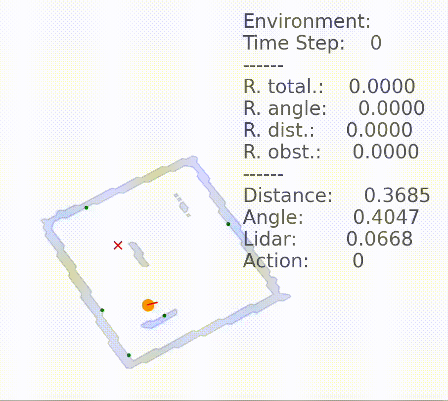

# RNL: Robot Navigation Learning Framework

<p align="center">
  <a href="https://pypi.org/project/rnl/"></a>
  <a href="https://github.com/microvault/microvault/actions/workflows/main.yaml"></a>

</p>

<p align="center">
  <strong>End-to-end Deep Reinforcement Learning for Real-World Robotics Navigation in PyTorch</strong>
</p>

## Overview

**RNL (Robot Navigation Learning)** is a comprehensive framework for training autonomous robots to navigate in unknown environments using Deep Reinforcement Learning (DRL). The framework provides a complete pipeline from environment simulation to model deployment, with support for both training and inference phases.

## Demo

<div align="center">
  
</div>

## Key Features

- 3D environment
- Wandb integration
- LIDAR simulation
- Robot parameters
- Differential drive
- Physics simulation
- Dynamic maps
- LLM integration

## Installation

### Prerequisites
- Python 3.10+
- PyTorch 2.5.1+
- CUDA (optional, for GPU acceleration)

### Install from PyPI
```bash
pip install rnl
```

## Quick Start

### 1. Basic Training Example

```python
import numpy as np
import rnl as vault

# Configure robot parameters
robot_config = vault.robot(
    base_radius=0.105,        # Robot radius in meters
    max_vel_linear=0.22,      # Maximum linear velocity
    max_vel_angular=2.84,     # Maximum angular velocity
    wheel_distance=0.16,      # Distance between wheels
    weight=1.0,               # Robot weight in kg
    threshold=1.0,            # Obstacle detection threshold
    collision=0.5,            # Collision radius
    path_model="None"         # Path to pretrained model
)

# Configure LIDAR sensor
sensor_config = vault.sensor(
    fov=2 * np.pi,           # Field of view (360 degrees)
    num_rays=20,             # Number of LIDAR rays
    min_range=0.0,           # Minimum detection range
    max_range=6.0            # Maximum detection range
)

# Configure environment
env_config = vault.make(
    scale=100,               # Environment scale
    folder_map="None",       # Custom map folder
    name_map="None",         # Custom map name
    max_timestep=10000       # Maximum episode length
)

# Configure rendering
render_config = vault.render(
    controller=False,        # Disable manual control (set True to control robot with arrow keys)
    debug=True,             # Enable debug visualization
    plot=False              # Disable plotting
)

# Initialize trainer
trainer = vault.Trainer(robot_config, sensor_config, env_config, render_config)

# Start training
trainer.learn(
    max_timestep_global=3000000,  # Total training steps
    seed=1,                       # Random seed
    batch_size=1024,             # Training batch size
    hidden_size=128,             # Neural network hidden size
    num_envs=4,                  # Parallel environments
    device="cuda",               # Training device
    checkpoint=10000,            # Checkpoint frequency
    use_wandb=True,             # Enable Wandb logging
    lr=0.0003,                  # Learning rate
    learn_step=512,             # Learning step size
    gae_lambda=0.95,            # GAE lambda parameter
    ent_coef=0.0,               # Entropy coefficient
    vf_coef=0.5,                # Value function coefficient
    max_grad_norm=0.5,          # Gradient clipping
    update_epochs=10,           # Update epochs
    name="navigation_model"      # Model name wandb
)
```

### 2. Inference Example

```python
import rnl as vault

# Use same configuration as training
# ... (robot_config, sensor_config, env_config, render_config)

# Initialize simulation
simulation = vault.Simulation(robot_config, sensor_config, env_config, render_config)

# Run inference
simulation.run()
```

### 3. Demo Mode

```bash
python main.py -m sim
```

## Advanced Features

### LLM Integration
The framework supports Large Language Model integration for automated reward engineering:

```python
trainer.learn(
    use_llm=True,
    llm_api_key="your_api_key",
    population=2,
    loop_feedback=10,
    description_task="reach the goal while avoiding obstacles efficiently"
)
```


### Parallel Training
The framework supports multi-environment parallel training for faster convergence:

```python
trainer.learn(
    num_envs=8,              # Number of parallel environments
    device="cuda",           # Use GPU acceleration
    batch_size=2048          # Larger batch size for parallel training
)
```

## ROS Integration

The framework includes ROS (Robot Operating System) integration for real-world deployment:

### Features
- TurtleBot3 support
- Gazebo simulation integration
- Real-world robot deployment
- SLAM (Simultaneous Localization and Mapping)
- Navigation stack integration

### ROS Workspace Structure
```
ros/
├── Dockerfile
├── docker-compose.yaml
└── tb3_ws/
    ├── src/playground/
    │   ├── launch/           # Launch files
    │   ├── maps/            # Environment maps
    │   ├── models/          # Trained models
    │   └── worlds/          # Gazebo worlds
    └── Makefile
```

### Running ROS Simulation
```bash
cd ros/tb3_ws
make build
make run
```

## Troubleshooting

### Common Issues

1. **CUDA Out of Memory**
   - Reduce `batch_size` or `num_envs`
   - Use smaller `hidden_size`

2. **Slow Training**
   - Increase `num_envs` for parallel training
   - Use GPU acceleration
   - Optimize `learn_step` parameter

3. **Unstable Training**
   - Adjust learning rate (`lr`)
   - Increase `update_epochs`

## Contributing

We welcome contributions! Please see our [Contributing Guide](CONTRIBUTING.md) for details.

## License

This project is licensed under the MIT License - see the [LICENSE](LICENSE) file for details.

## Support

- **Issues**: [GitHub Issues](https://github.com/microvault/rnl/issues)
- **Email**: grottimeireles@gmail.com
